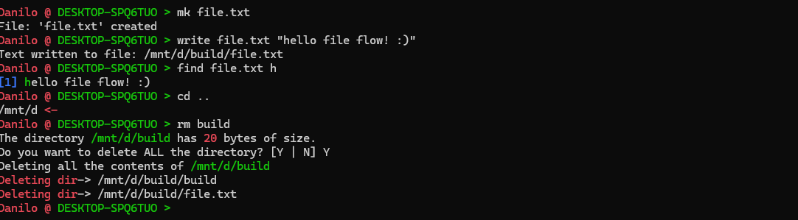

# FileFlow

## Overview

An File Automation language bash like, is compatible with linux, windows and MacOS, it has: compression commands, file task commands (move, cut directories/files, remove directories/files, write, reads, et cetera).
Use the 'help' command to see more informations or /docs.




## Usage:

```  bash
mkdir build
cd build
cmake ..
make
./FileFlow
```

If you wanna to use FileFlow as a system command (make the program executable for any directory) you can use the follow command:

``` bash
sudo cp FileFlow /usr/local/bin/
```

on Windows you should run this command as admin, to use FileFlow as a system command: 

``` bash
Copy-Item -Path .\FileFlow.exe -Destination "C:\Windows\System32\"
```

## Why i created FileFlow

- To challenge myself by building an entire bash-like scripting language from scratch, covering the full cycle from user input, input parsing, until command processing.

- To provide a single, lightweight tool that handles all common file automation with an imperative language, tasks without relying on multiple external utilities.

## What roblems FileFlow solves

- Simplifies simple automation routines—backups, batch removes, compressions—without memorizing numerous flags, simple rename commands, all into a portalble self contained tool

## Why i choose C

- I have yet to see a language that offers all the performance and memory control that C does, that fits this project very well.
- Direct access with OS apis without extra abstraction layers
- Provides a great challenge to improve my low-level abilities